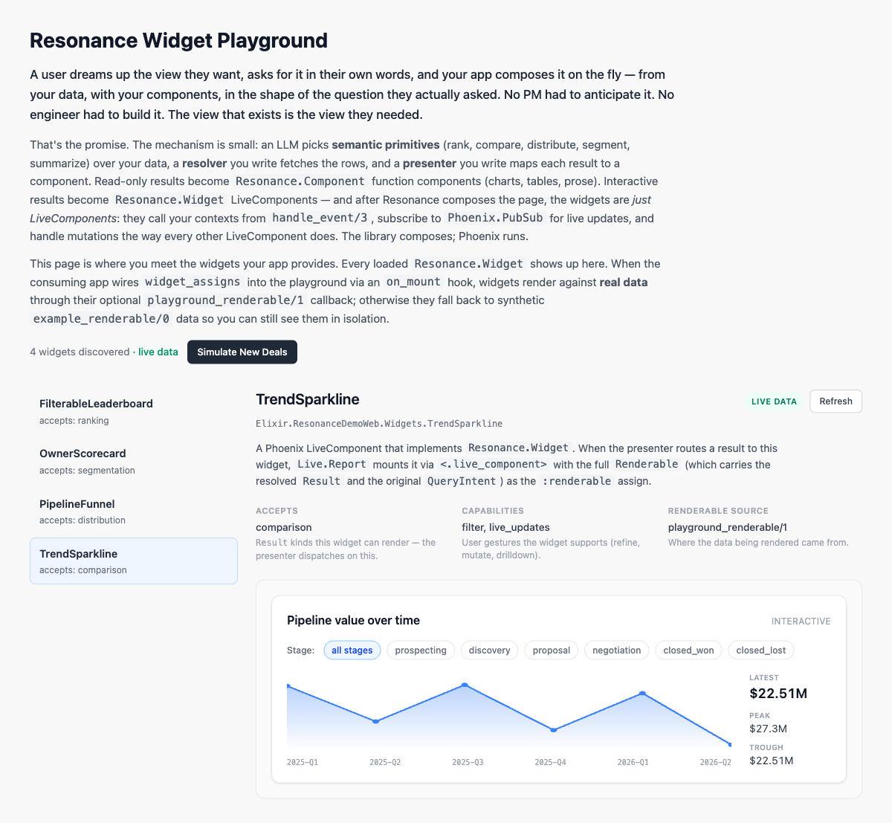

# Resonance

**Generative analysis surfaces for Phoenix LiveView.**

An Elixir library that lets users ask questions about application data and receive composed, app-native UI built from semantic primitives and streamed via LiveView.

> *Resonance lets the user's question pick from the developer's design system.*
>
> The developer defines the look, components, and data; Resonance is the runtime that lets a user's natural-language question compose those into a new view at query time. Models are smart enough to know what a user wants, they just need the right context from the developer to build it.



*The widget playground — every `Resonance.Widget` your app provides, enumerated and rendered against real data through your own contexts. Filter chips, refresh, and live PubSub-driven updates all work the way Phoenix LiveComponents already do; Resonance just composed the page.*

## How It Works

```
User: "Show me deal pipeline by stage"
  ↓
LLM selects semantic primitives: [show_distribution, summarize_findings]
  ↓
Each primitive resolves data via your app's Resolver
  ↓
A Presenter maps the resolved data to UI components
  ↓
LiveView streams components progressively as they resolve
```

The LLM does not generate UI directly. It selects semantic operations over your data. Resonance resolves those operations, your Presenter maps them to components, and the result streams to the browser.

## Quick Start

Add to your `mix.exs`:

```elixir
def deps do
  [{:resonance, "~> 0.1"}]
end
```

Configure your LLM provider:

```elixir
# config/runtime.exs
config :resonance,
  provider: :anthropic,
  api_key: System.get_env("ANTHROPIC_API_KEY"),
  model: "claude-sonnet-4-5"
```

Drop the component into any LiveView:

```elixir
<.live_component
  module={Resonance.Live.Report}
  id="explore"
  resolver={MyApp.DataResolver}
  current_user={@current_user}
/>
```

You need two things: a **Resolver** (data layer) and a **presentation setup** (chart library + optional custom Presenter).

## Writing a Resolver

The Resolver is your data access layer. It tells the LLM what's available, validates requests, and runs queries. Implement the `Resonance.Resolver` behaviour:

```elixir
defmodule MyApp.DataResolver do
  @behaviour Resonance.Resolver

  @impl true
  def describe do
    """
    Datasets:
    - "orders" — fields: total, status, created_at, customer_id
      measures: count(*), sum(total), avg(total)
      dimensions: status, month, customer

    - "customers" — fields: name, plan, region
      measures: count(*)
      dimensions: plan, region
    """
  end

  @impl true
  def validate(%Resonance.QueryIntent{dataset: dataset}, _context) do
    if dataset in ~w(orders customers),
      do: :ok,
      else: {:error, :unknown_dataset}
  end

  @impl true
  def resolve(%Resonance.QueryIntent{} = intent, context) do
    # Build Ecto query from intent, return normalized rows
    {:ok, rows}
  end
end
```

### The `describe/0` callback

This is critical. The string you return becomes part of the LLM's system prompt. It's how the model knows what datasets exist, what fields are queryable, and what measures and dimensions are valid. Be specific — vague descriptions produce vague queries.

### The `validate/2` callback

Security boundary to check that the dataset is allowed, the user has permission, and the query makes sense. Return `:ok` or `{:error, reason}`. Optional — if not implemented, validation is skipped.

### The `resolve/2` callback

Receives a structured `QueryIntent` and returns data:

```elixir
%Resonance.QueryIntent{
  dataset: "orders",
  measures: ["sum(total)"],
  dimensions: ["status"],
  filters: [%{field: "status", op: "=", value: "active"}],
  sort: %{field: "total", direction: :desc},
  limit: 10
}
```

**Return format:** a list of flat maps with at minimum `label` and `value` keys:

```elixir
{:ok, [
  %{label: "Active", value: 42000},
  %{label: "Pending", value: 18000},
  %{label: "Cancelled", value: 5000}
]}
```

For time-series data, include a `period` key:

```elixir
{:ok, [
  %{label: "2025-Q1", period: "2025-Q1", value: 42000},
  %{label: "2025-Q2", period: "2025-Q2", value: 58000}
]}
```

For multi-series data (e.g., revenue by status over time), include `series`:

```elixir
{:ok, [
  %{label: "2025-Q1", period: "2025-Q1", series: "Active", value: 30000},
  %{label: "2025-Q1", period: "2025-Q1", series: "Pending", value: 12000},
  %{label: "2025-Q2", period: "2025-Q2", series: "Active", value: 40000},
  %{label: "2025-Q2", period: "2025-Q2", series: "Pending", value: 18000}
]}
```

The resolver returns flat rows. The Presenter and chart hooks handle structuring into series, hierarchies, or whatever the visualization needs.

## Presentation

Primitives produce a `Result` (what the data says). A `Presenter` maps it to a `Renderable` (how it looks). You control the Presenter.

### Architecture

```
Primitive → Resolver → Result → Presenter → Renderable → LiveView
(library)   (you)      (data)   (you)       (component)   (surface)
```

Each `Result` has a `kind` indicating the semantic operation:

| Kind | Meaning | Typical visualization |
|------|---------|----------------------|
| `:comparison` | Values across time periods | Line chart, bar chart |
| `:ranking` | Entities ordered by metric | Bar chart, table |
| `:distribution` | Proportions of a whole | Pie/donut, treemap, bar |
| `:segmentation` | Population broken into groups | Metric cards, table |
| `:summary` | Narrative analysis | Prose section |

### Option A: Use the defaults

The library ships `Resonance.Presenters.Default` which uses ApexCharts. This is the zero-config path.

**1. Install ApexCharts:**

```bash
cd assets && npm install apexcharts
```

**2. Register the hooks in your `app.js`:**

```javascript
import ApexCharts from "apexcharts"
window.ApexCharts = ApexCharts

// Copy hooks from the library's assets/js/hooks/charts.js
// or import if your build system supports it
import {ResonanceHooks} from "./resonance_hooks"

const liveSocket = new LiveSocket("/live", Socket, {
  hooks: {...ResonanceHooks}
})
```

**3. Import the CSS** in your `app.css`:

```css
@import "path/to/resonance/assets/css/resonance.css";
```

**4. Use the Report component** with no `presenter` assign — the default is used automatically:

```elixir
<.live_component
  module={Resonance.Live.Report}
  id="report"
  resolver={MyApp.DataResolver}
/>
```

### Option B: Bring your own chart library

Write a custom Presenter to use any chart library, component system, or design framework.

**1. Create chart components** — Phoenix function components that render your chart library's hooks:

```elixir
defmodule MyApp.Components.ChartJsBar do
  use Phoenix.Component

  # Required for live data updates — return the DOM id of the hook element
  def chart_dom_id(renderable_id), do: "chartjs-bar-#{renderable_id}"

  def render(assigns) do
    ~H"""
    <div class="my-chart-wrapper">
      <h3 :if={@props[:title]}><%= @props.title %></h3>
      <canvas
        id={"chartjs-bar-#{@renderable_id}"}
        phx-hook="ChartJsBar"
        phx-update="ignore"
        data-chart-data={Jason.encode!(@props.data)}
      />
    </div>
    """
  end
end
```

**2. Create JS hooks** for your chart library. Hooks must:
- Read data from `data-chart-data` (JSON array of `{label, value}` maps)
- Listen for `resonance:update-chart` events for live data updates

```javascript
export const ChartJsBar = {
  mounted() {
    const data = JSON.parse(this.el.dataset.chartData || "[]");
    this.chart = new Chart(this.el, buildBarConfig(data));

    this.handleEvent("resonance:update-chart", ({ id, data }) => {
      if (id === this.el.id) {
        this.chart.data = buildChartData(data);
        this.chart.update();
      }
    });
  },
  destroyed() { if (this.chart) this.chart.destroy(); }
};
```

**3. Write a Presenter** — pattern-match on `result.kind` to select your components:

```elixir
defmodule MyApp.Presenters.Custom do
  @behaviour Resonance.Presenter

  alias Resonance.{Renderable, Result}

  @impl true
  def present(%Result{kind: :distribution} = result, _context) do
    Renderable.ready("show_distribution", MyApp.Components.Treemap, %{
      title: result.title,
      data: result.data
    })
  end

  def present(%Result{kind: :ranking} = result, _context) do
    Renderable.ready("rank_entities", MyApp.Components.ChartJsBar, %{
      title: result.title,
      data: result.data,
      orientation: "horizontal"
    })
  end

  # Delegate kinds you don't need to customize
  def present(result, context) do
    Resonance.Presenters.Default.present(result, context)
  end
end
```

**4. Pass your Presenter** to the Report component:

```elixir
<.live_component
  module={Resonance.Live.Report}
  id="report"
  resolver={MyApp.DataResolver}
  presenter={MyApp.Presenters.Custom}
/>
```

### The component contract

Chart components receive two assigns:
- `@props` — the props map from the Renderable (always includes `title` and `data`)
- `@renderable_id` — unique stable ID for the chart instance

If your component manages a JS chart (anything with `phx-update="ignore"`), implement `chart_dom_id/1` returning the DOM id of the hook element. This lets `Live.Report` push data updates for smooth in-place refreshes.

## Semantic Primitives

| Primitive | Purpose | Result kind |
|-----------|---------|-------------|
| `compare_over_time` | Trends across time periods | `:comparison` |
| `rank_entities` | Order by metric | `:ranking` |
| `show_distribution` | Proportions/composition | `:distribution` |
| `summarize_findings` | Narrative analysis | `:summary` |
| `segment_population` | Group breakdown | `:segmentation` |

Custom primitives implement `Resonance.Primitive` and register at runtime:

```elixir
Resonance.Registry.register("my_primitive", MyApp.Primitives.Custom)
```

## Streaming and Data Refresh

Components stream progressively as each primitive resolves. The LLM call is blocking, but resolution is parallel. Each primitive resolves independently and appears in the UI the moment it's ready.

The Report component stores tool calls from the LLM response. When underlying data changes, `refresh` replays the same tool calls against fresh data — no LLM re-call:

```elixir
send_update(Resonance.Live.Report, id: "explore", refresh: true)
```

## Programmatic API

```elixir
# Batch: resolve all primitives, return when complete
{:ok, components} = Resonance.generate(prompt, %{
  resolver: MyApp.DataResolver,
  current_user: user
})

# Streaming: receive components as they resolve
Resonance.generate_stream(prompt, context, self())
# Receive {:resonance, {:component_ready, renderable}} for each
# Receive {:resonance, :done} when complete
```

## LLM Providers

Built-in support for Anthropic and OpenAI. Custom providers implement `Resonance.LLM.Provider`:

```elixir
config :resonance, provider: MyApp.CustomProvider
```

## Example Apps

Two example apps demonstrate the architecture with different domains and different chart libraries:

### CRM Demo (`example/resonance_demo/`)

Sales pipeline dashboard using the **default presenter** (ApexCharts). Entity-centric data — companies, contacts, deals, activities.

```bash
cd example/resonance_demo && mix setup && mix phx.server
# localhost:4000/explore
```

### Finance Demo (`example/finance_demo/`)

Personal finance dashboard using a **custom ECharts presenter**. Category-hierarchical data — accounts, transactions, budgets. Proves the presentation layer is fully swappable: treemaps instead of donuts, same semantic primitives.

```bash
cd example/finance_demo && mix setup && mix phx.server
# localhost:4001/explore
```

Both require `ANTHROPIC_API_KEY`.

## Development

```bash
mix deps.get          # Install dependencies
mix test              # Run library tests
mix test.all          # Run library + both demo app tests
mix build.all         # Compile everything
mix format            # Format code
```

## Philosophy

### Beyond the Fixed Dashboard

Software teams build the 80% case: 80% correct for roughly 80% of people. The other 20% file tickets, build spreadsheets, or learn to live without the view they actually needed.

But a language model can interpret a user's intent and map it to structured operations over real data. Instead of a product team anticipating every possible view and pre-building it, the user states what they want and the system composes it on demand. A view that answers "which customers lapsed this quarter and why" doesn't need to exist as a page in your app. It can be generated from the question itself against real data in real time.

Nobody wants to have an unending conversation with their CRM. They want a one-shot output; a composed analytical surface (charts, tables, metrics, narrative) that looks and behaves like a page your team built, whether they planned it out or not.

### Why a Semantic Layer

Vercel's AI SDK takes the direct approach: the LLM picks React components via tool calls. Ask about weather, get a `<WeatherCard>`. Ask about stocks, get a `<StockChart>`. The model selects widgets.

This works for demos but it breaks down because it couples the model's understanding directly to your component library. The LLM needs to know the difference between a bar chart and a line chart, and when to use each. Change your charting library? Update your tool definitions. Add a mobile layout? Teach the model new components. The presentation layer becomes part of the prompt.

Resonance inserts a semantic layer between the LLM and the UI. The model doesn't pick a bar chart. It picks `rank_entities`, an analytical operation meaning "order these things by a metric." A Presenter inspects the resolved data and chooses the right component: a horizontal bar chart for 4 items, a sortable table for 40. Same intent, different data, different presentation, and the model never had to care.

You can swap chart libraries without touching the LLM integration. You can add device-specific rendering without rewriting tool schemas. You can change how "show distribution" looks without changing what it means. The model operates on stable analytical concepts; the UI is free to evolve independently.

### Riding on Phoenix LiveView

Resonance is a thin layer over Phoenix primitives, not a parallel universe. The composition engine, the streaming, the interactive widgets — all of it is the things Phoenix already does well, arranged in service of generative UI.

- **`Task.Supervisor.async_stream`** runs primitives in parallel. Each primitive resolves in its own supervised, unlinked task.
- **LiveView streams** push each resolved component to the browser the moment it's ready — no waiting for the slowest query. Same WebSocket the rest of your app already uses.
- **`Phoenix.LiveComponent`** *is* the widget contract. A `Resonance.Widget` is a LiveComponent with one extra behaviour callback. `handle_event/3` calls your contexts directly; once the widget mounts, Resonance is gone from the runtime path.
- **`Phoenix.PubSub` + `send_update/2`** works. Subscribe in the parent LiveView, push a refreshed `:renderable` into the widget — the same pattern you'd use for any other LiveComponent.
- **`live_session` + `on_mount`** wires to your contexts and current user, so widgets render against actual data instead of fixtures.

Resonance composes the question into a starting page. From there, everything is Phoenix — same lifecycle, same patterns, same debugging tools your team already knows.

## Interactive widgets (v2)

v0.1 is read-only generated reports. v0.2 adds a small contract on top of LiveView so the same composed report can be **interactive**.

Resonance composes the page from the user's question; once the widget is mounted, Resonance is gone from the runtime path. Widgets are Phoenix LiveComponents — they call your app contexts from `handle_event/3`, manage local state in assigns, and handle mutations the same way every other LiveComponent does. The library composes; Phoenix runs.

A presenter can return a **`Resonance.Widget`** — a Phoenix LiveComponent that implements one extra behaviour — instead of a function component:

```elixir
defmodule MyApp.Widgets.FilterableLeaderboard do
  use Resonance.Widget   # gives you LiveComponent + the behaviour

  alias MyApp.Deals

  @impl Resonance.Widget
  def accepts_results, do: [:ranking]

  @impl Resonance.Widget
  def capabilities, do: [:filter, :live_updates]

  @impl Resonance.Widget
  def example_renderable, do: # synthetic Renderable for the playground

  # ===== From here down it's a normal Phoenix LiveComponent =====

  @impl Phoenix.LiveComponent
  def update(%{renderable: r} = assigns, socket) do
    {:ok,
     socket
     |> assign(:title, r.props.title)
     |> assign(:rows, r.props.rows)
     |> assign(:active_stage, r.props[:active_stage])
     |> assign(:current_user, assigns[:current_user])}
  end

  @impl Phoenix.LiveComponent
  def handle_event("filter_stage", %{"stage" => stage}, socket) do
    # Call your own context directly. No Resonance machinery on this path.
    rows = Deals.top_by_value(stage: stage, user: socket.assigns.current_user)
    {:noreply, socket |> assign(:active_stage, stage) |> assign(:rows, rows)}
  end

  def render(assigns), do: ~H"..."
end
```

In your Presenter, return `Renderable.ready_live/3` instead of `ready/3` for kinds you want interactive. The presenter is also where you unpack the LLM-resolved `Result.intent` into clean widget props:

```elixir
def present(%Result{kind: :ranking, intent: %{dataset: "deals"} = intent} = result, _ctx) do
  Renderable.ready_live("rank_entities", FilterableLeaderboard, %{
    title: result.title,
    rows: result.data,
    active_stage: stage_filter_value(intent.filters)  # presenter unpacks the intent
  })
end
```

`Live.Report` notices `render_via: :live` and dispatches to `<.live_component>` instead of the function component, threading any `widget_assigns` map you pass through:

```elixir
<.live_component
  module={Resonance.Live.Report}
  id="explore"
  resolver={MyApp.Resolver}
  presenter={MyApp.Presenter}
  widget_assigns={%{current_user: @current_user}}
/>
```

Everything else — your Resolver, the LLM tool flow, the function component path for read-only charts — is unchanged.

### Live updates from data changes

Because widgets are real LiveComponents, you handle live updates the way Phoenix already does it: subscribe to a `Phoenix.PubSub` topic in the *parent LiveView*, and on receiving a message call `Phoenix.LiveView.send_update/2` to push a refreshed `:renderable` (or fresh assigns) into the widget. LiveComponents share their parent process and can't subscribe directly — but the parent owning the subscription is the standard pattern.

### The widget contract

- **Required:** `accepts_results/0` returns the list of `Result` kinds the widget can render.
- **Optional:** `capabilities/0` declares which user gestures the widget supports (developer documentation, shown in the playground).
- **Optional:** `example_renderable/0` returns a synthetic Renderable the playground draws.
- **Optional:** `playground_renderable/1` returns a Renderable built from real data (called by the playground when an `on_mount` hook provides `widget_assigns`).
- **From `LiveComponent`:** `update/2` accepts a `:renderable` assign. The widget reads `:props` for initial state. Everything else is normal LiveComponent.

### Playground

Mount `Resonance.Live.Playground` in your router to get a developer page that enumerates every loaded widget, shows its declared metadata, and renders each one against either its `example_renderable/0` (synthetic data) or its `playground_renderable/1` (real data, if you wire an `on_mount` hook):

```elixir
# router.ex (static, synthetic data only)
scope "/" do
  pipe_through :browser
  live "/resonance/playground", Resonance.Live.Playground
end

# router.ex (live data — playground talks to your real contexts)
live_session :playground, on_mount: MyAppWeb.PlaygroundContext do
  live "/resonance/playground", Resonance.Live.Playground
end
```

The on_mount hook drops `:widget_assigns`, optionally a `:simulate_fn` for a "regenerate sample data" button, and `:pubsub` + `:subscribe_topics` for auto-refresh-on-broadcast. Don't expose the playground on a public route — it's a developer surface.

## Where This Goes

The structured `QueryIntent` is an intermediate representation AST with explicit datasets, measures, dimensions, and filters. The resolver is already a trust boundary with permission enforcement. The primitive system is extensible at runtime. The presenter layer is swappable. The widget contract bridges into the full Phoenix LiveComponent ecosystem with one extra callback. The vision: a Phoenix developer uses Resonance to generate on-the-fly real-time pages, fully interactive, with the look and feel and contracts defined entirely by their app. Resonance composes the question into a starting page; Phoenix runs everything from there.

## Why "Resonance"?

> *Cognitum est in cognoscente per modum cognoscentis.*
> "The thing known exists in the knower according to the mode of the knower."
> — Thomas Aquinas

What happens when an inquiry activates structured knowledge and produces insight? Let's say it resonates.

The LLM holds compressed patterns about data analysis and user intent — knowledge in *its* mode. Your app holds the actual data and domain logic — knowledge in *its* mode. Neither produces the right view alone. When the user's question passes through the LLM and activates the right primitives against real data, something emerges that was not in either system: a composed surface that answers a question nobody pre-built a report for.

## License

MIT
